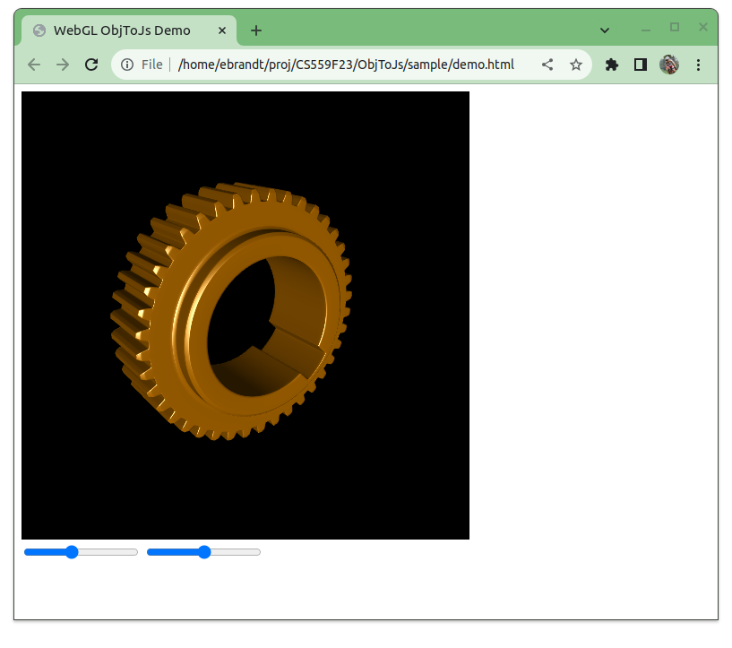

# ObjToJs

`obj_to_js` is a simple Python script that converts a Wavefront `*.obj` format file to a Javascript file containing array definitions for Vertex Positions, Vertex Normals, and Triangle Indices that can more easily be used in Javascript webgl applications.

This utility is written specifically to support UW Madison's CS559 Computer Graphics class, but may be useful in other venues.

## Usage

Usage information is available via the command line with the `-h` option:
```
$ python obj_to_js.py -h
usage: Obj to Js Converter [-h] in_file [out_file] [model_name]

Helpful Utility for UW Madison CS559 webgl assignments

positional arguments:
  in_file     input .obj file
  out_file    output .js file
  model_name  model name for variable in js

optional arguments:
  -h, --help  show this help message and exit

Additional info available at https://github.com/elbrandt/ObjToJs
```

## Example Usage

1. Find an interesting `.obj` file on the internet and download it (or craft your own)
2. Translate it to a `.js` file using the `obj_to_js.py` script:
```
$ python obj_to_js.py models/Gear1.obj sample/Gear1.js

Tranlsating 'models/Gear1.obj' to 'sample/Gear1.js'...
Stats:
        unique vertex positions  : 17378
        unique vertex normals    : 15553
        unique vertex tex coords : 19672
        total vertices           : 19672
        total normals            : 19672
        total tex coords         : 19672
        triangles                : 34756
        bb_min                   : [-6.07, -0.0004, -2.0687]
        bb_max                   : [6.07, 12.1396, 2.0687]

Tranlsated 'models/Gear1.obj' to model 'my_model' in 'sample/Gear1.js' in 0.290 sec.
```
3. Test your conversion using the webgl example in the [`sample` folder](https://github.com/elbrandt/ObjToJs/tree/main/sample):

 a. Modify the `demo.html` file to include your `.js` file before the inclusion of `demo.js`
 
 b. If you used a 3rd parameter when running `obj_to_js.py` to specify a custom model name, replace occurrences of `my_model` in `demo.js` with your model name.

The demo program [here](https://github.com/elbrandt/ObjToJs/tree/main/sample) has been written to load a model that is defined by a `.js` from this utility. It will set the camera to make entire model visible and provide simple sliders to move the camera and rotate the model. 

## Limitations
- This utility only supports translating polygonal face objects in the `.obj` file.  Specifically, it reads only the following element types:
  - `v` vertex geometry location 
  - `vt` vertex texture coordinate (optional)
  - `vn` vertex normal (optional, created by `obj_to_js.py` if not present in file)
  - `f` polygonal face

- It does not support any of the curve or surface specifications.

- It does not support negative index references (not common in `*.obj` files, but possible per the spec).

- While it *does* translate vertex texture coordinates if present in the `.obj` file, it *does not* provide any additional support to load or assign textures to the model in the output `.js` file.

- It has been tested on Python 3.9.x. It doesn't use any non-standard Python modules. It should be compatible with earlier Python 3.x versions as well, but this has not been tested.

- The script does some rudimentary processing to attempt to not repeat vertices unnecessarily, but is not claimed to be optimal. 

## Disclaimer
This utility has been tested on a relatively small sample of the wide world of `.obj` files available on the internet. There are probably weird-but-valid `.obj` files that will cause the script to fail. If you encounter such an `.obj` file, let the authors know, we'd be interested in taking a look.

## Screenshot

